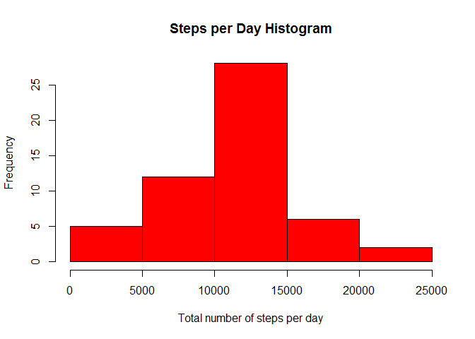
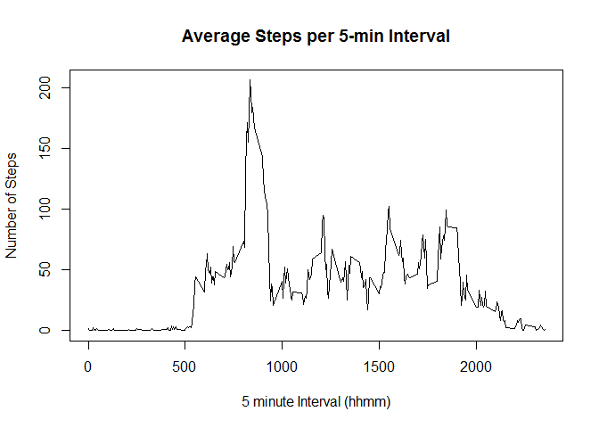
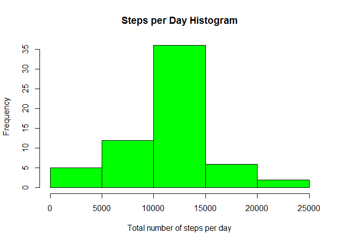

# Reproducible Research: Peer Assessment 1

## Loading and preprocessing the data

Load the appropriate libraries.


```r
library(dplyr)
library(knitr)
opts_chunk$set(echo = TRUE, results = "hide")
```

Read the data from the appropriate source file ("activity.csv") in the current working directory.  
The data-set contains observations for the 61 days; from 2012-10-01 to 2012-11-30.  
Each day has 288 observations, one for each 5 minute interval, with the count of steps taken in the interval.   
Each interval is identified with a label in the format 'hhmm', where 'hh' specifies the hour (0 to 23) and 'mm' specifies the minutes (0 to 55)


```r
# Read source data from appropriate file in the current working directory
data_all <- read.csv("activity.csv")

# Split observations that contain actual device readings, from those without data
data_obs <- filter(data_all, !is.na(steps))
data_na  <- filter(data_all, is.na(steps))

# These should have been in-lined in the knitr markdown; included here for clarity.
cols <- ncol(data_all)
rows_all <- nrow(data_all)
rows_obs <- nrow(data_obs)
```

The data set has 3 variables (columns) and 17568 observations, out of which 15264 have actual device readings.

*****

## What is mean total number of steps taken per day?

The histogram of the total number of steps taken each day (ignoring the missing values in the dataset).


```r
# Summarize total number of steps for each day
by_day <- group_by(data_obs, date)
steps_day <- summarize(by_day, steps = sum(steps))

# Generate histogram
hist(steps_day$steps, col="red", main="Steps per Day Histogram", xlab="Total number of steps per day")
```

 

```r
# Mean and median
mean_day <- mean(steps_day$steps)
median_day <- median(steps_day$steps)
```

The mean number of steps per day is 10766.19, the median is 10765.00

*****

## What is the average daily activity pattern?

This is a time-series plot of the average number of steps taken in each 5-minute interval, averaged across all days.


```r
# Calculate the average number of steps for each 5-minute interval across all days
by_interval <- group_by(data_obs, interval)
steps_interval <- summarize(by_interval, steps = mean(steps))

# Generate line plot
plot(steps_interval$interval, steps_interval$steps, type="l", main="Average Steps per 5-min Interval",
     xlab="Interval (5-minute)", ylab="Number of Steps")
```

 

```r
#Find the interval with the maximum number of steps
idx <- which.max(steps_interval$steps)
max_steps = steps_interval[idx, "steps"]
interval = steps_interval[idx, "interval"]
```

The 8.35 interval is the one with the maximum average number of steps (206.17).

*****

## Imputing missing values


The original data set has 2304 observations with missing values; 13.11% of the total number of 5-minute intervals in the two month period.  

Will impute the missing values with the average steps for the corresponding 5-minute interval.


```r
# Keep only the date and interval columns of the observations with NAs,
# then add the average steps for the corresponding 5-min interval 
data_imp <- data_na %>% select(date, interval) %>% left_join(steps_interval, by = "interval")

# Bind the actual device readings and the imputed observations
data_full <- bind_rows(data_obs, data_imp)

# Summarize total number of steps for each day
by_day <- group_by(data_full, date)
steps_day <- summarize(by_day, steps = sum(steps))

# Generate histogram
hist(steps_day$steps, col="green", main="Steps per Day Histogram", xlab="Total number of steps per day")
```

 


## Are there differences in activity patterns between weekdays and weekends?
