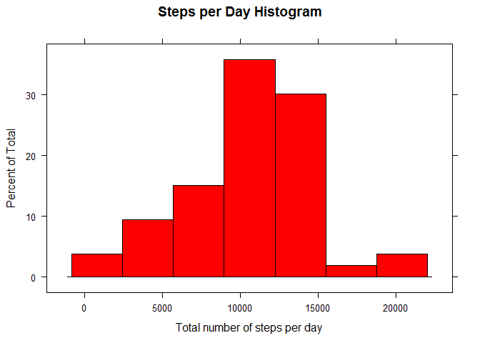
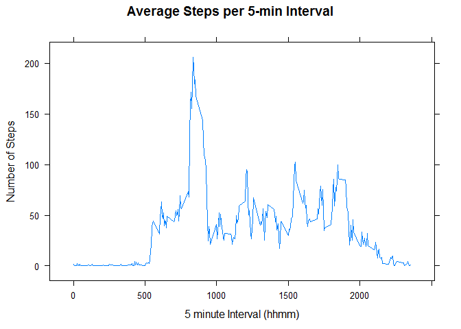
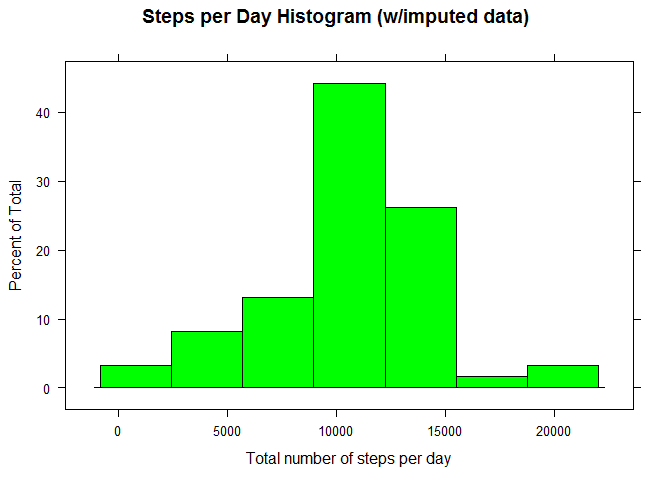
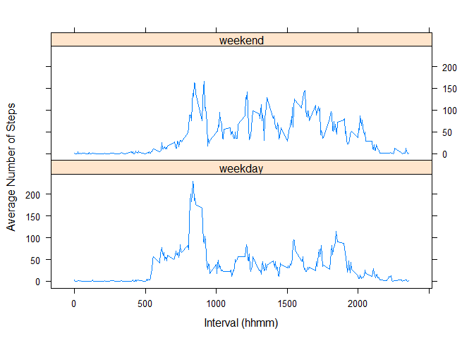

# Reproducible Research: Peer Assessment 1

## Loading and preprocessing the data

Load the appropriate libraries.


```r
library(dplyr)
library(knitr)
library(lattice)
opts_chunk$set(echo = TRUE, results = "hide")
```

Read the data from the appropriate source file ("activity.csv") in the current working directory.  

The data-set contains observations for 61 days; from 2012-10-01 to 2012-11-30.  
Each day has 288 observations, one for each 5 minute interval, along with the count of steps taken in the interval.  

Each interval is identified with a label in the format 'hhmm', where 'hh' specifies the hour (0 to 23) and 'mm' specifies the minutes (0 to 55)


```r
# Read source data from appropriate file in the current working directory
data_all <- read.csv("activity.csv")

# Split observations that contain actual device readings, from those with missing data
data_obs <- filter(data_all, !is.na(steps))
data_na  <- filter(data_all, is.na(steps))

# These should have been in-lined in the knitr markdown; included here for clarity.
cols <- ncol(data_all)
rows_all <- nrow(data_all)
rows_obs <- nrow(data_obs)
```

The data set has 3 variables (columns) and 17568 observations, out of which 15264 have actual device readings.

*****

## What is mean total number of steps taken per day?

A histogram of the total number of steps taken each day (ignoring the missing values in the dataset) is shown here:


```r
# Summarize total number of steps for each day
steps_day <- data_obs %>% group_by(date) %>% summarize(steps = sum(steps))

# Generate histogram
histogram(~steps, data = steps_day, col="red", 
          main="Steps per Day Histogram",
          xlab="Total number of steps per day")
```

 

```r
# Mean and median
mean_day <- mean(steps_day$steps)
median_day <- median(steps_day$steps)
```

The mean number of steps per day is 10766.19, the median is 10765.00.

*****

## What is the average daily activity pattern?

This is a time-series plot of the mean number of steps taken
in each 5-minute interval, averaged across all days.


```r
# Calculate the average number of steps for each 5-minute interval across all days
steps_interval <- data_obs %>% group_by(interval) %>% summarize(steps = mean(steps))

# Generate line plot 
xyplot(steps ~ interval, data = steps_interval, type="l",
       main="Average Steps per 5-min Interval",
       xlab="5 minute Interval (hhmm)",
       ylab="Number of Steps")
```

 

```r
#Find the interval with the maximum number of steps
idx <- which.max(steps_interval$steps)
max_steps <- steps_interval[idx, "steps"]
interval  <- steps_interval[idx, "interval"]
```

The 8.35 interval is the one with the maximum average number of steps (206.17).

*****

## Imputing missing values


The original data set has 2304 observations with missing values; 13.11% of the total number of 5-minute intervals in the two-month period.  

Will impute the missing values with the average steps for the corresponding 5-minute interval.


```r
# Keep only the date and interval columns of the observations with NA's,
# then add a column with the average steps for the corresponding 5-min interval 
data_imp <- data_na %>% select(date, interval) %>%
            left_join(steps_interval, by = "interval")

# Bind the actual device readings and the imputed observations
data_full <- bind_rows(data_obs, data_imp)

# Summarize total number of steps for each day
stepsi_day <- data_full %>% group_by(date) %>% summarize(steps = sum(steps))

# Generate histogram
histogram(~steps, data = stepsi_day, col="green",
          main="Steps per Day Histogram (w/imputed data)",
          xlab="Total number of steps per day")
```

 

```r
# New mean and median
meani_day <- mean(stepsi_day$steps)
mediani_day <- median(stepsi_day$steps)
```

Now we have observations for 61 days; initially we had observations for only 53 days.

The new mean number of steps per day is 10766.19, the new median is 10766.19;
basically unchanged as expected since we imputed the average number of steps for each 5-min interval.

*****

## Are there differences in activity patterns between weekdays and weekends?


The graphs below depict the difference in activity patterns between weekdays and weekends.


```r
# Change Locale to obtain weekday names in English
lct <- Sys.getlocale("LC_TIME")
Sys.setlocale("LC_TIME", "C")

# Create a data frame to map days to weekday or weekend factor
day_map <- data_frame(day = c("Mon", "Tue", "Wed", "Thu", "Fri", "Sat", "Sun"),
                      weekday = factor(c("weekday", "weekday", "weekday",
                                         "weekday", "weekday", "weekend", "weekend")))

# Add day and weekday columns to the observations
data_day <- data_full %>% mutate(day = weekdays(as.Date(date), abbreviate=TRUE)) %>%
                          left_join(day_map, by = "day")

# Group observations by interval and weekday, calculate the mean number of steps
steps_interval_wd <- data_day %>% group_by(interval, weekday) %>%
                                  summarize(steps = mean(steps))

# Plot the results
xyplot(steps ~ interval | weekday, data = steps_interval_wd, type="l",
       layout = c(1, 2), xlab="Interval (hhmm)", ylab="Average Number of Steps")
```

 

```r
# Restore Locale
Sys.setlocale("LC_TIME", lct)
```


### End of report
Author: LLN  
Date: June 13, 2015  

*****
